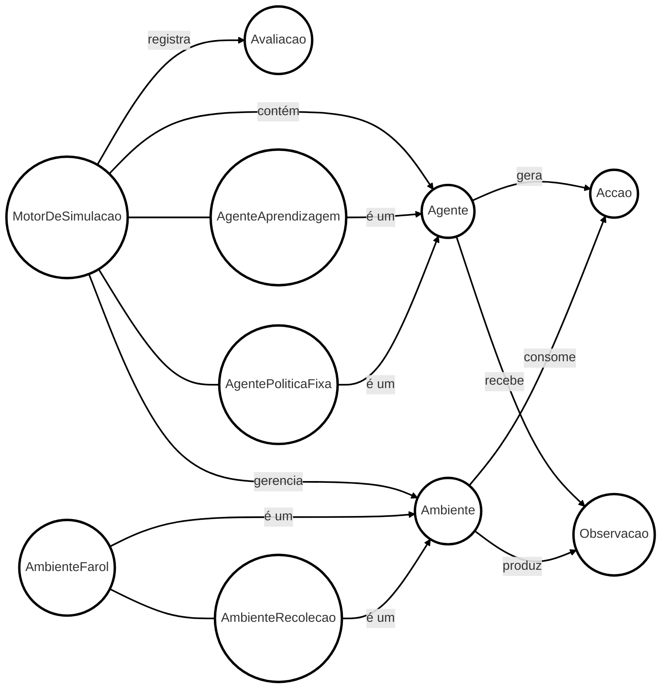

```mermaid
flowchart LR
  %% Nós ontológicos (mais simples que UML). Labels em português.
  Motor((MotorDeSimulacao))
  Aval((Avaliacao))
  Agente((Agente))
  Ambiente((Ambiente))
  AgApr((AgenteAprendizagem))
  AgFixa((AgentePoliticaFixa))
  AFarol((AmbienteFarol))
  ARecol((AmbienteRecolecao))
  Observ((Observacao))
  Accao((Accao))

  %% Relações principais (rotuladas, em português)
  Motor -->|gerencia| Ambiente
  Motor -->|contém| Agente
  Motor -->|registra| Aval

  AgApr -->|é um| Agente
  AgFixa -->|é um| Agente

  AFarol -->|é um| Ambiente
  ARecol -->|é um| Ambiente

  Agente -->|recebe| Observ
  Agente -->|gera| Accao
  Ambiente -->|consome| Accao
  Ambiente -->|produz| Observ


  %% Pequenas arestas invisíveis para melhorar alinhamento
  Motor --- AgApr
  Motor --- AgFixa
  AFarol --- ARecol

  %% Estilo: preenchimento claro e bordas roxas, links roxos
  style Motor fill:#FFFFFF,stroke:#000000,stroke-width:3px
  style Aval fill:#FFFFFF,stroke:#000000,stroke-width:3px
  style Agente fill:#FFFFFF,stroke:#000000,stroke-width:3px
  style Ambiente fill:#FFFFFF,stroke:#000000,stroke-width:3px
  style AgApr fill:#FFFFFF,stroke:#000000,stroke-width:3px
  style AgFixa fill:#FFFFFF,stroke:#000000,stroke-width:3px
  style AFarol fill:#FFFFFF,stroke:#000000,stroke-width:3px
  style ARecol fill:#FFFFFF,stroke:#000000,stroke-width:3px
  style Observ fill:#FFFFFF,stroke:#000000,stroke-width:3px
  style Accao fill:#FFFFFF,stroke:#000000,stroke-width:3px

  linkStyle default stroke:#000000,stroke-width:2px

```
